# CodeX 重装芯片计算器使用说明
主程序为“CodeX.exe”。目录下会附带有其他支持文件以及“GF_Tool_Server.exe”，该程序来自于这个[芯片提取工具](https://bbs.nga.cn/read.php?tid=19277807)，也可单独使用。  
[视频教程](https://www.bilibili.com/video/BV1r7411N75u/)  
以下为详细使用步骤：  
## 1. 打开主程序
双击“CodeX.exe”，将进入主界面如下：  
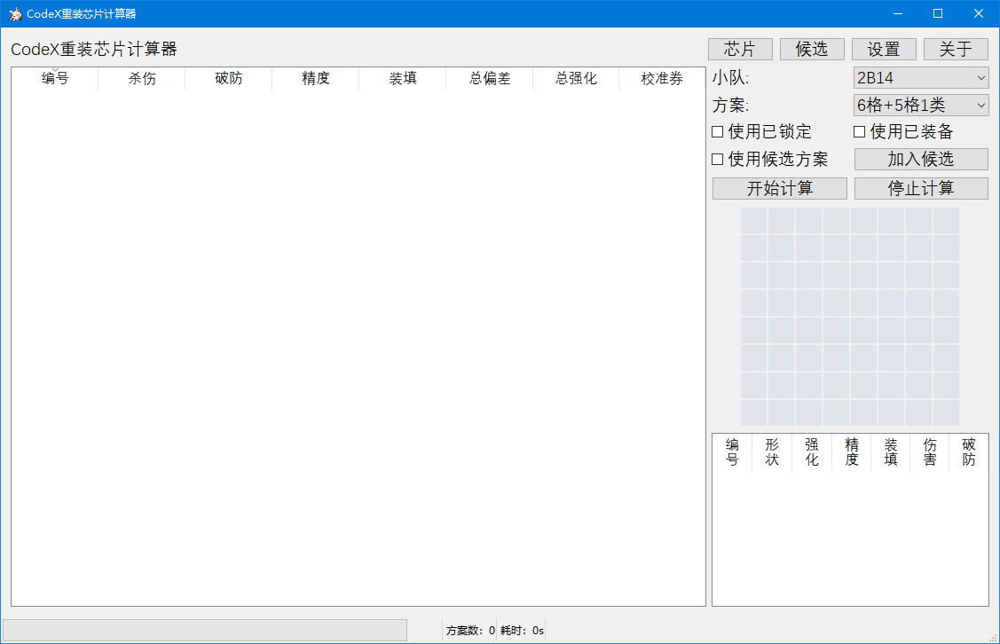  
## 2. 获取芯片数据
单击右上角的“芯片”按钮，打开芯片数据窗口。  
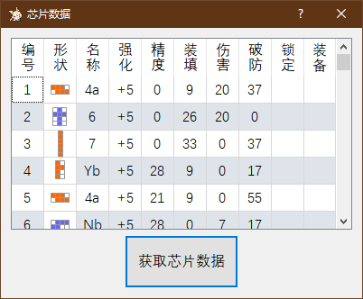  
如果之前已经读取好芯片数据，这里会显示芯片数据，以及当前各重装小队装备的芯片的参数。
如果没有，可以单击“获取芯片数据”打开新的窗口。  
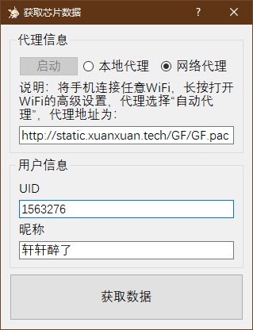  
这里可以看到“本地代理”和“网络代理”两个选项，其中本地代理将启动附带的“GF_Tool_Server.exe”程序进行代理，而网络代理则将使用网络服务器进行代理。  
两个代理的原理是完全一致的，只不过一个是部署在服务器上，一个是部署在用户本机电脑上。程序已开源（见前言）。  
出于安全性考虑，使用网络代理**建议在使用前后修改密码**。  
本地代理适合于部分没有自动代理的手机（ViVo），而本地代理出错或者没有WiFi的时候可以用网络代理。  

### 2.1. 使用网络代理  
选择网络代理时，下方的文本框会显示自动代理地址，地址为：  
`http://static.xuanxuan.tech/GF/GF.pac`  
需要将该地址设置到手机中。以下说明以安卓手机为例:  
打开手机，连接任意WiFi，长按选择修改网络，打开高级选项，代理模式为“自动”或“自动配置”，将该地址填入，例如：  
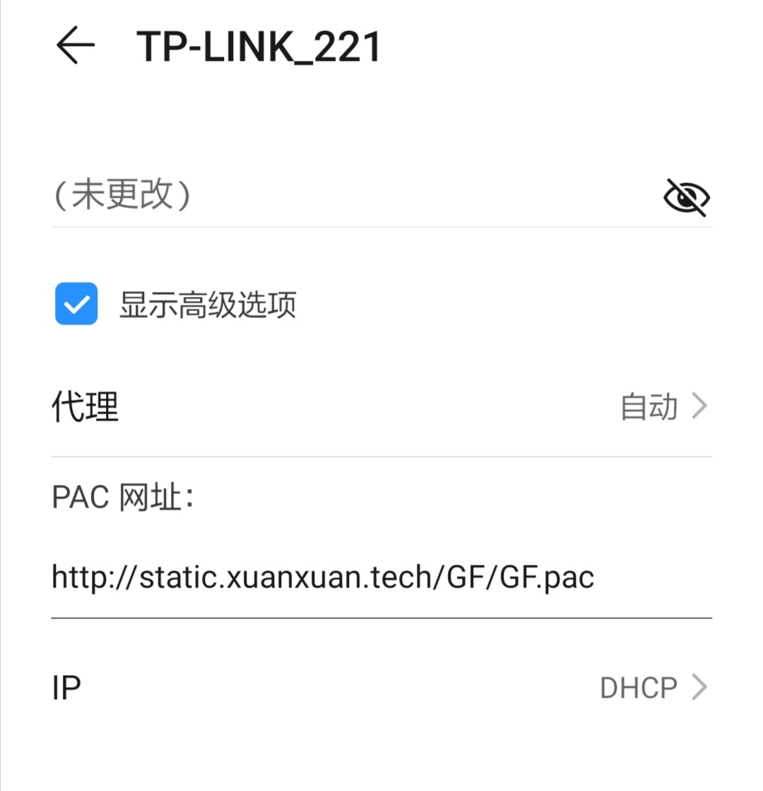  
然后保存设置。  
随后完全退出游戏并重新进入。为了避免滥用服务器，此时进入游戏后将卡死在基地界面无法操作，出现此情况也代表着代理设置正确。  
此时在“获取芯片数据”窗口中，准确填写UID和昵称信息，单击“获取数据”，即可读取到芯片数据。如弹出错误请按错误说明重试。  

### 2.2. 使用本地代理  
选择本地代理时，“启动”按钮将亮起：  
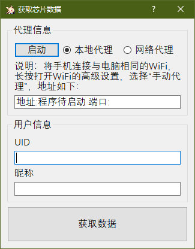  
单击“启动”按钮，程序启动时，防火墙可能会弹出提示，此时请选择允许其通信，注意勾选“专用网络”。  
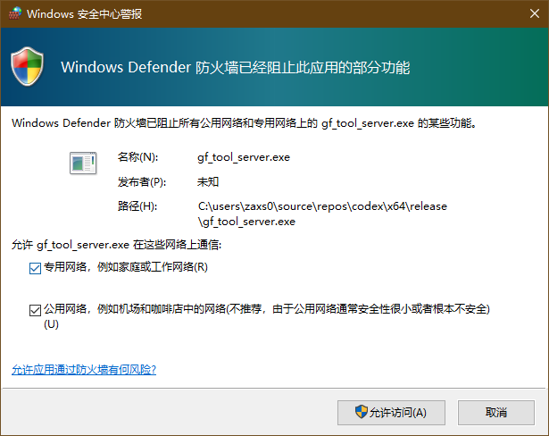  
启动成功后将弹出成功提示，同时文本框会提示代理地址与端口：  
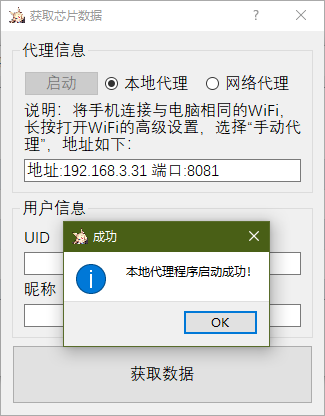  
例如，这里显示的代理地址为`192.168.3.31`，端口为`8081`。需要将该地址设置到手机中。以下说明以安卓手机为例:   
打开手机，连接与电脑同一局域网的WiFi，长按选择修改网络，打开高级选项，选择代理模式为“手动”，将地址和端口分别填入，例如：  
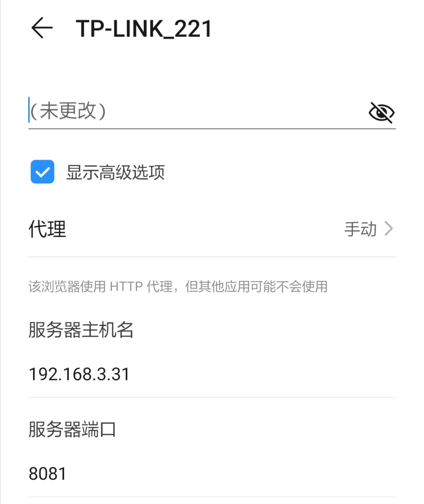  
然后保存设置。  
随后完全退出游戏并重新进入。进入基地界面后，即可在“获取芯片数据”窗口中，准确填写UID和昵称信息，单击“获取数据”，即可读取到芯片数据。如弹出错误请按错误说明重试。  

## 3. 设置重装小队参数
在主界面右上角，可以选择不同的重装小队以及对应的方案，例如AT4有“只用6格”和“使用5格”两种方案：  
  
另外也可以勾选“使用已锁定”按钮来在计算过程中使用游戏中锁定的芯片。  
勾选“使用已装备”按钮会在计算过程中使用游戏中已经装备到重装小队上的芯片。  
勾选“使用候选方案”则会在计算过程中使用已经添加到候选方案列表中的方案中使用到的芯片。  
单击主界面右上角“设置”按钮，可以打开设置窗口。这里可以设置各个重装的目标属性格数以及要求解的方案数量。重装属性默认为公认的最优解，单击“重置”按钮可以恢复。  
“自由”一栏表示最终方案允许的格数偏差值。  
“计算方案数”表示整个计算过程中最多计算的方案数量，而程序会从中按属性总偏差值取出top n个显示在界面上，n由显示方案数指定。
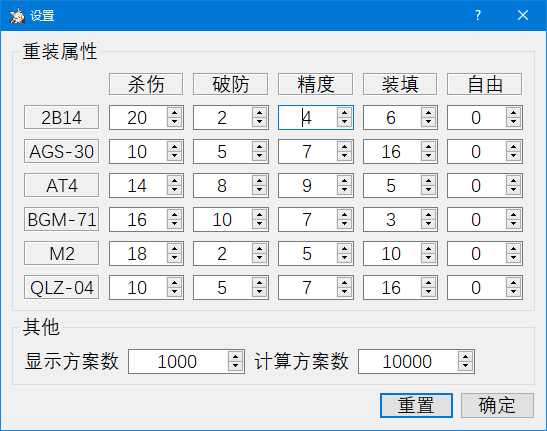  
设置完成后，单击“开始计算”即可执行计算过程。  

## 4. 查看方案
计算完成后，主界面将显示芯片方案如下：  
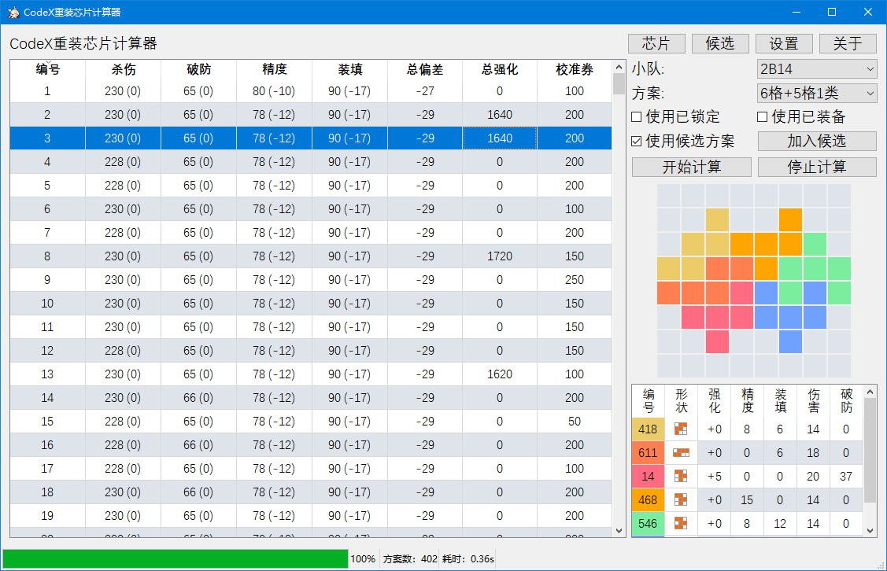  
单击左侧任意方案，会在右侧显示拼法图解以及所用到的芯片。  
在左侧的方案列表中，四项属性是当前方案所有芯片满强化后的总属性，而括号中的数值是与属性上限的差值，如果溢出则为0。总偏差也是计算的所有不足的属性之和，溢出部分不计入。  
也就是说，括号中的数值越大越好，总偏差越大（绝对值越小）越好。  
总等级一列是该方案中所有芯片的强化等级，以供参考当前方案能节省多少强化资源。  
校准券一列提供了当前方案需要消耗的校准券的参考值。可能存在误差。  
单击表头可以按各列属性分别排序。  

## 5. 查看候选方案
在主界面的方案列表中单击选择任意方案后，可以单击右侧的“加入候选”按钮将该方案加入到候选方案列表中。  
单击主界面的“候选”按钮可以打开候选方案窗口如下：  
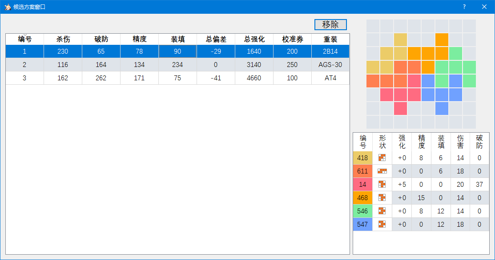  
在这里可以查看候选方案列表中的各个方案，包括拼法详情。  
也可从这里将方案删除候选。  

## 6. 关于台服
在使用代理过程中，无论是本地代理还是网络代理，操作一样如下：  
将压缩包中的[ca.crt]传送到手机上安装，之后正常操作。  
对于安卓7以上，app可以主动选择不认用户安装的证书，人工把装好的证书丢进系统证书目录里才能用  
需要从把证书`/data/misc/user/0/cacerts-added/`挪到`/system/etc/security/cacerts/`  
因此推荐使用模拟器读取数据，因为目前模拟器普遍在安卓5-6。  

# 最后
本程序(包括附带的GF_Tool_Server)均已开源(涉及直接解密游戏数据的部分除外)，欢迎贡献代码。  
转载请注明出处，禁止用于商业。  

# 联系我
[GitHub](https://github.com/xxzl0130/CodeX)  
[NGA](https://bbs.nga.cn/read.php?tid=20284990)  
[Mail:zaxs0130@gmail.com](mailto:zaxs0130@gmail.com)
